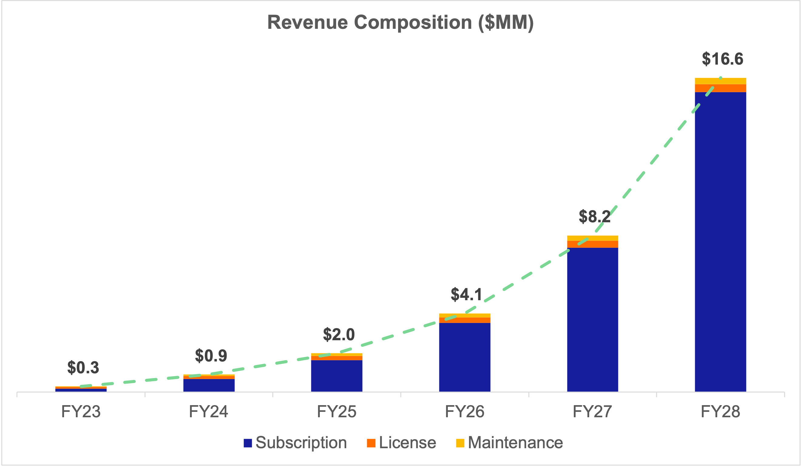
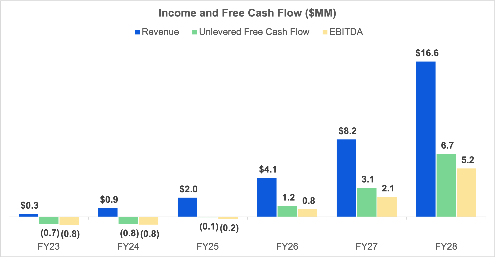

# SaaS-FCF-Model
Excel-based free cash flow model for Software-as-a-Service businesses.

Download the model [here](https://github.com/rovertm/SaaS-FCF-Model/blob/main/SaaS-FCF-Model-20221207.xlsx)

***

## Table of Contents

1. [About](#about)
2. [Use Cases](#use_cases)
3. [Model Components](#components)
    
    3.1 [Revenue Drivers](#rev_drivers)
    
    3.2 [Expense Drivers](#exp_drivers)
    
    3.3 [Balance Sheet & Cash Flow Proxy](#bs_cfs)
    
    3.4 [Profit & Loss](#pl)
    
    3.5 [Summary](#summary)

4. [File Descriptions](#files)
5. [Licensing & Authors](#licensing)

## About 

Excel-based financial model for calculating unlevered free cash flow via various revenue and expense driver assumptions. The model projects revenue and expenses in full detail and uses a balance sheet / cash flow statement proxy for core working capital items and capital expenditures.

Key elements within revenue and expense drivers are linked to scenario-based values (base, upside, downside) that can be toggled dynamically within the General Assumptions section at the top of the model. 

The model assumes (i) subscription, (ii) license, and (iii) maintenance revenue items with respective customer growth and retention rates. Revenue per full-time R&D employee is assumed to drive R&D headcount and associated operating expenses.

## Use Cases 

1. Unlevered free cash flow projections for founders and strategy teams at software start-ups
2. Starting template for valuation analysis 
3. Starting template for a comprehensive operating model

## Model Components 

### Revenue Drivers 

* Calculates new customer growth and retention for subscription, license, and maintenance revenue streams

### Expense Drivers 

* Calculates Cost of Revenues and operating expenses via gross profit and R&D employee productivity assumptions

### Balance Sheet and Cash Flow Proxy 

* Calculates core operating asset & liabilities via links to select rev/expense items
* Calculates capital expenditures and depreciation
* Net Operating Loss / Tax schedule 

### Profit and Loss 

* Income statement proxy
* Revenue, gross profit, operating income, interest expense, net income

### Summary 

* Calculates unlevered free cash flow
* Output charts

## Installation 

* Microsoft Excel - required if working local
* Google Sheets - upload to Google Drive, open as sheets

## File Descriptions 

* SaaS-FCF-Model-{DATE}.xlsx - financial model
* SaaS-FCF-MindMap.xmind - xmind mind map
* SaaS-FCF-MindMap.png - mind map image
* SaaS-FCF-RevComposition.png - revenue chart
* SaaS-FCF-IncomeFCF.png - free cash flow chart 

## Licensing & Authors 

All repo assets were developed by me and are open to all for use.

